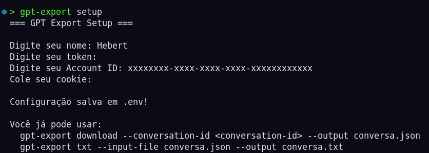
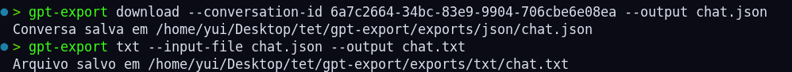
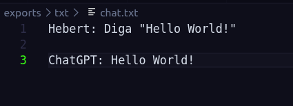

# GPT Export

Uma ferramenta de linha de comando (CLI) para exportar conversas do ChatGPT e convertê-las para formatos mais fáceis de armazenar, pesquisar e reutilizar.

> **Aviso:** este projeto utiliza endpoints internos utilizados pela interface web do ChatGPT. Eles não são públicos nem estáveis e podem mudar a qualquer momento.

---

## Motivação

Quem utiliza o ChatGPT para estudar, documentar projetos ou desenvolver software costuma acumular conversas muito valiosas.

Embora seja possível visualizar essas conversas pelo navegador, nem sempre é fácil:

* fazer backup de um chat específico;
* pesquisar o conteúdo utilizando ferramentas locais;
* alimentar outras IAs com uma conversa antiga;
* arquivar projetos em um formato simples;
* manter conversas importantes junto aos arquivos de um projeto.

O objetivo do **GPT Export** é facilitar esse processo, permitindo transformar uma conversa do ChatGPT em arquivos que podem ser armazenados e utilizados fora da interface web.

---

## Funcionalidades

* Exportação de conversas do ChatGPT Web.
* Salvamento da resposta original em JSON.
* Conversão do histórico para um TXT legível.
* Preservação da ordem das mensagens.
* Nomes dos participantes configuráveis.
* Configuração das credenciais através do próprio CLI.
* Interface simples via linha de comando.

---

## Exemplos

### Extrai uma conversa do ChatGPT

```bash
gpt-export download --conversation-id <conversation-id> --output conversa.json
```

### Exportar uma conversa para TXT

```bash
gpt-export txt --input-file conversa.json --output conversa.txt
```

Nota sobre caminhos de saída

Os arquivos exportados são gravados em diretórios padrão. Ao usar as opções `--output` ou `--input-file`, passe apenas o nome do arquivo — o programa irá salvar/ler os arquivos nos diretórios padrão (por exemplo `./exports/json/` e `./exports/txt/`).

O resultado pode ser utilizado diretamente em ferramentas locais de pesquisa, arquivamento ou processamento.

### Exemplo de saída

```text
Hebert:
Como funciona o FastAPI?

ChatGPT:
FastAPI é um framework moderno para criação de APIs...

Hebert:
E como faço autenticação?

ChatGPT:
Você pode utilizar JWT...
```

---

## Configuração

Antes de utilizar a ferramenta pela primeira vez, execute:

```bash
gpt-export setup
```

O CLI irá solicitar as informações necessárias e criar o arquivo `.env` automaticamente.

```text
=== GPT Export Setup ===

Digite seu nome: Hebert
Digite seu token: ********
Digite seu Account ID: ********
Cole seu cookie: ********

Configuração salva em .env!
```

> As credenciais utilizadas são da própria sessão do usuário no ChatGPT e devem ser mantidas em segredo. O arquivo `.env` não deve ser versionado.

Para mais informações sobre como obter essas credenciais, consulte a documentação do projeto.

---

## Capturas de tela

### Configuração inicial



<br>

### Exportando uma conversa



<br>

### Arquivo TXT gerado



---

## Como funciona

O fluxo principal da aplicação é:

```text
ChatGPT
    │
    ▼
Cliente HTTP
    │
    ▼
Conversa em JSON
    │
    ▼
Parser
    │
    ▼
Exportador
    │
    ▼
JSON / TXT
```

A aplicação separa a comunicação com o ChatGPT, o processamento da estrutura da conversa e a geração dos arquivos.

Essa organização também permite adicionar novos formatos de exportação no futuro, como:

* Markdown
* HTML
* PDF
* Outros formatos personalizados

---

## Possíveis usos

* Backup de conversas importantes.
* Arquivamento de projetos desenvolvidos com IA.
* Compartilhamento de conversas.
* Pesquisa local utilizando ferramentas como `grep` ou `ripgrep`.
* Alimentação de pipelines de IA/RAG.
* Conversão para outros formatos.
* Preservação de discussões técnicas para consulta futura.

---

## Estrutura do projeto

```text
gpt-export/
├── gpt_export/
│   ├── client.py
│   ├── cli.py
│   ├── config.py
│   ├── core.py
│   ├── parser.py
│   ├── utils.py
│   └── exporters/
│       └── txt.py
├── .env.example
├── README.md
├── requirements.txt
└── ...
```

---

## Limitações

O GPT Export depende de endpoints internos utilizados pelo ChatGPT Web.

Por isso:

* os endpoints podem mudar sem aviso;
* tokens e cookies podem expirar;
* mudanças na autenticação podem exigir alterações no projeto;
* a ferramenta pode deixar de funcionar temporariamente após mudanças na plataforma.

O projeto não pretende substituir uma API oficial do ChatGPT.

---

## Aviso

Este projeto não é afiliado à OpenAI.

Ele foi desenvolvido para fins educacionais e de automação pessoal, utilizando endpoints observados na aplicação web do ChatGPT.

**Nunca compartilhe seus tokens, cookies ou outros dados de autenticação.**

---

## Licença

Este projeto está disponível sob a licença MIT.
